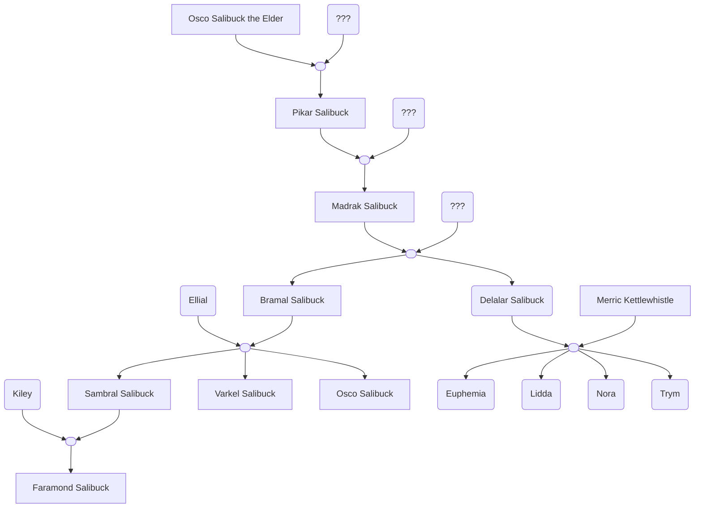

# Salibuck Family
<span class="subhead">[Brandarthall](../places/brandarthall.md), Sea Ward of Waterdeep</span>

The Salibucks are a family of halflings that are affiliated closely with the Brandarth family ([Lord Renaer Neverember](renaer-neverember.md)'s maternal line).

<span class="nav">[Details](#Details) [Relationships](#Relationships) [Secrets](#Secrets) [Related](#Related) [History](#History)</span>

## Details

- **Madrak Salibuck**: White-haired halfling butler. Knew Renaer’s mother; promised her to keep an eye on Renaer.  All servants (family or not) report to Madrak; 112 years old ^madrak
    - **Bramal Salibuck** (Madrak’s son) and his children oversee the Brandarth estates. Bramal has long dark hair, which he ties at the nape of his neck. 82 years old ^bramal
    - **👩‍❤️‍👨 Ellial Salibuck** (Bramal's wife) runs the kitchen. 75 years old ^ellial
        - **Sambral Salibuck** (Bramal's son) is trusted to collect rents and manage affairs; seems nearly immune to mind-affecting magics. 51 years old ^sambral
        - **👩‍❤️‍👨 Kiley Salibuck** (Sambral's wife) is impeccably well-dressed and groomed. She believes it is important to be wise and neat and clean. Her very long wavy light brown hair is styled in elaborate braids. 49 years old. ^kiley
            - **Faramond Salibuck** (Sambral and Kiley's son) is very popular, always able to entertain with a detailed and thoughtful story. He believes it is important to choose one's own goals and to be restrained. He believes you should be content with what you have. He is only 22 years old (an old soul). ^faramond
        - **Osco Salibuck** (Bramal's son, Madrak's grandson) wears silver rings in his left nostril and earlobe. Troublemaker, Rogue, but also friend to [Vajra "Blackstaff" Safahr](vajra-safahr.md). Chosen by Blackstaff Tower, etc. 47 years old. ^osco
        - **Varkel Salibuck** (Bramal's son, sandy-haired, enthusiastic) -- Can remember every word spoken to him. Sent to listen for rumors at the palace on a fast pony after Vajra Safahr was rescued. 43 years old. ^varkel
    - **Delalar** (Madrak's daughter) has tan skin and brown eyes. Her curly brown and gray hair falls down past her shoulders. She is pretty short (even for a halfling). She is 74 years old (adult), 2 ft, 9 in (84 cm) tall, and weighs 37 lbs (17 kg). She is even-tempered. *According to Osco, she faints a lot.* ^delalar
    - **👩‍❤️‍👨 Merric Kettlewhistle** (Delalar's husband) is a rich, talkative caretaker, 76 ^merric
        - [Kettlewhistle Sisters](kettlewhistle-sisters.md) 4 girls, in their 30s.

## Relationships

The are long-time friends of [Lord Renaer Neverember](renaer-neverember.md) and his mother's family.  When Renaer's mother died, Madrak Salibuck promised to care for Renaer.

## Secrets

## Related

```dataviewjs
const { Campaign } = window.customJS;
dv.list(Campaign.linkedToPage(dv));
```

## History

The Salibucks also have a history of being friends of the Blackstaff

- **Pikar Salibuck** (deceased) was **Madrak**'s father, and was a sorcerer in Blackstaff Tower. There is a statue of Pikar in the tower, *Pickar Salibuck. Friend of Two Blackstaff. Tamer of the Three Fires of Harlard. Vanquisher of Huillethar the Devourer. He Stood Tall in Art and Life.*  Osco had the same dimpled chin.
- **Osco Salibuck the Elder** (deceased, **Pikar**'s father) was also honored with a statue in Blackstaff Tower: *Osco Salibuck the Elder. Agent of Khelben. Ampratines' Friend. Infiltrator Extraordinaire. No Fear Hindered Hin.*.

