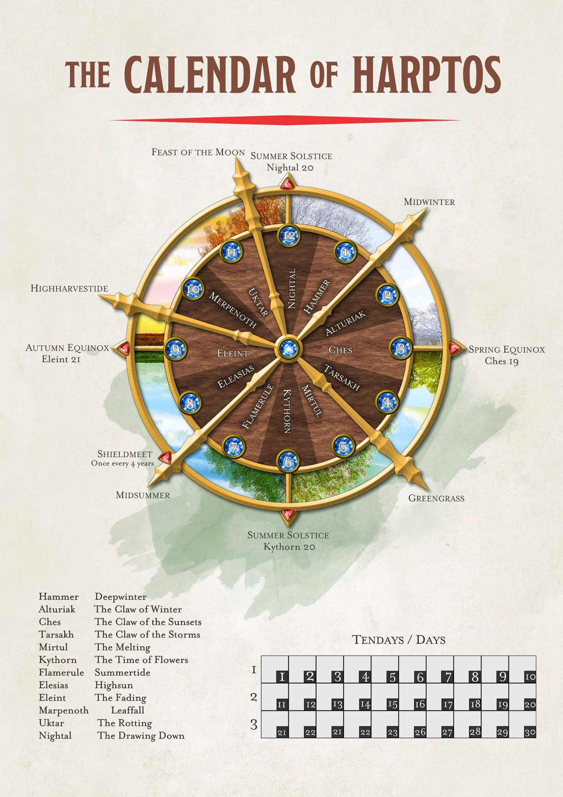

# Time

he Faerunian day is 24 hours long, broken up by the rising and setting sun. 

Most people break up the day into large slices:  
dawn, morning, highsun (noon), afternoon, dusk, sunset, evening, midnight, moondark (night's heart), and night's end.

Large cities use temple bells to mark the hours

